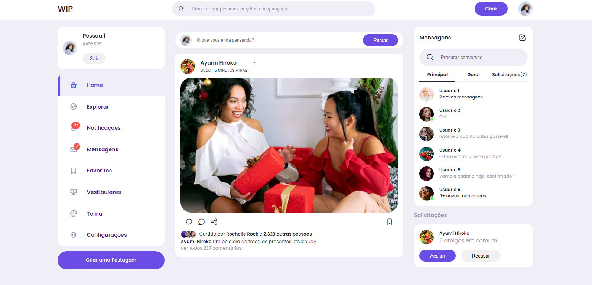

# WIP - WORK IN PROGRESS

> This project was my final paper from technic course and have the _objetive to be a social media for the students of a school_ so 
we abording some strands to the people socialize between the instituion like a comoun social media with 
chats to be trade messages, but we treat to make by a *spefic mean education*, having a part for contents about knowledge like homeworks, tasks, vestibular or even students groups. 

**JUST THE FRONT-END PROTOTYPE** ⚠️

## Some field the aplication uses 

+  HOME
+   - Back for home page
+  EXPLORER
+    - To know other people
+  NOTIFICATIONS
+  MESSAGES
+  FAVORITES
+    - Set favorites contents
+  VESTIBULARS
    - Those strad that the student user can talk about everthing education mean
+  THEME 
    - The user can change the color and font size of the page 
+  CONFIGURATION 

## Others users model 

+  LOGIN
+   - Email
+   - Password
+  PROFILE
    - Photo
    - Name
+  POSTS
    - Then photos how also texts

### TECHNOLOGIES USED ON THIS REPOSITORY 

> HTML, 
> JAVASCRIPT,
> CSS
